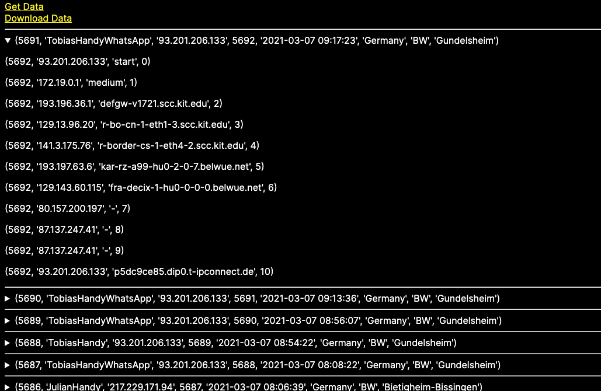
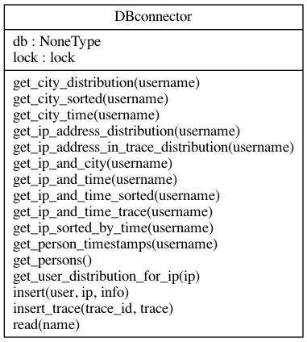
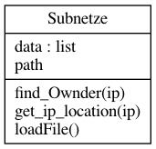

# IP-Collector

## Abstrakt

Es wird immer wichtiger ein Benutzer beim Anmelden mit Online-Diensten zu authentifizieren. Dabei stellt sich die Frage, wie oft der Benutzer sein Passwort oder andere Identifizierungsmerkmale eingeben soll. Diese Projektarbeit untersucht die Verwendung von IP-Tracking und die Daten, die daraus gewonnen werden können. Anhand der Daten kann anschließend das Nutzerverhalten verfolgt werden um Anomalien zu erkennen und die Daten des Benutzers zu schützen. Der Fokus dieser Arbeit liegt primär auf dem Sammeln von realistischen Nutzerinformationen und der Auswertung dieser Daten. Dazu wurde eine Website entwickelt.

## Einleitung

Als Projektarbeit hatten wir die initiale Aufgabe, Nutzer anhand ihrer IP-Adresse mit Hilfe von Machine Learning zu erkennen. Da wir aber noch keine Testdaten hatten, entwickelte sich das Projekt zu einem IP-Collector, mit dem Schwerpunkt des Sammelns und Auswerten von Daten. Diese könnten dann als Inputdaten für Machine Learning Modelle verwendet werden.

Dazu haben wir im Laufe der Projektarbeit einen Webserver mit einer Datenbank entwickelt. Unsere Endgeräte (Handys) haben den Benutzer simuliert und regelmäßig _Post_-Nachrichten an den Webserver gesendet. Der Webserver wendet anhand der IP-Adresse der _Post-_Anfrage einen Reverse Traceroute an und speichert die Daten. Neben dem Sammeln von Testdaten haben wir auch Diagramme generiert, um die gesammelten Daten auszuwerten.
### Daten

Für das Verfolgen des Nutzers ist es wichtig, dass wir eine Vielzahl von Daten sammeln. Folgende Daten werden durch die Webseite erfasst:

#### IP-Adresse

Die Kerndaten, die unsere Webseite sammelt sind IP- Adressen. Diese erhalten wir, wenn ein Nutzer eine Anfrage an die Webseite durchführt.

#### Traceroute

Haben wir eine Anfrage erhalten, wird ein sogenannter Traceroute auf die IP-Adresse von dem Server aus durchgeführt. Hier auch als Reverse-Traceroute bezeichnet. Dabei wird ermittelt, über welche Router und Internet-Knoten die Anfrage gesprungen ist. Wir erhalten Informationen aus welchem Netz der Benutzer kommt, sowie Informationen über den ISP. Diese Daten werden zusammen mit der IP-Adresse gespeichert.  

#### Zeit

Neben den Anfragen, speichert die Webseite auch die Zeit der Anfrage. Damit können wir später Rückschlüsse über das Nutzerverhalten ziehen und Gewohnheiten der Nutzer erkennen. 

#### ISP

Jede IP-Adresse ist in einem Subnetz. Dieses ist wiederum einem Internet Service Provider zugeordnet. Anhand der Informationen von welchem ISP eine Anfrage kommt, kann beispielsweise festgestellt werden, ob ein Nutzer bei der Telekom oder Unitymedia ist, was wiederum zur Anomalie-Erkennung verwendet werden kann.

#### Geographische Daten

Durch einen IP-Address Lookup-Service sind wir in der Lage, die IP-Adressen auf eine geographische Lage abzubilden. Der Lookup-Service liefert für jede IP-Adresse eine ungefähre Position in Form einer Stadt. Damit lassen sich Bewegungsmuster der Nutzer herstellen.

### Aufbau der Webseite

Die fertige Webseite ist in vier Tabs aufgeteilt:

#### Home

Auf der Startseite können manuell Anfragen eingegeben werden.

Wird über das Textfeld ein Name eingegeben und abgeschickt, wendet der Server im Hintergrund eine Traceroute Anfrage an und speichert die Daten in einer Datenbank. Das Textfeld verwendet die gleiche _Post-Route_ wie auch die Clients, was nochmal genauer im Abschnitt Clients erläutert wird.

#### View Data

Der Header besteht aus vier Teilen:

*   Ganz links werden die einzelnen Nutzer mit den Anzahl der Einträge angezeigt. Hier ist zu sehen, dass der Benutzer _JulianHandy _die meisten Einträge hat. Klickt man auf einen Nutzer, werden nur diese Einträge angezeigt.
*   Running Traces zeigt die aktuell laufenden Reverse Traces. Ein Trace benötigt Zeit und um zu sehen wie viele Traces aktuell laufen wird hier die jeweilige ID des Traces dargestellt.
*   Die Spalte _Measurement amount in last 20 Days,_ zeigt die relative Anzahl der Anfragen in den letzten Tagen in Form eines Diagramms an.
*   Die Spalte _Total amount in last 20 Days,_ zeigt die totale Anzahl der Anfragen in den letzten Tagen an. Hier ist zu sehen, dass der Benutzer _JulianHandy _die meisten Anfragen an den Server gestellt hat.

Der untere Teil der Webseite zeigt die unverarbeiteten Daten:

Jeder Eintrag ist eine Anfrage an den Server mit dem Name des Endgerätes. Klickt man auf ein Eintrag, sieht man die Traceroute History mit den einzelnen Knoten über den die Anfrage gesprungen ist.

Über die zwei Knöpfe _Get Data_ und _Download Data_, können die Daten als JSON heruntergeladen werden. 

#### View Diagramm

Hier werden automatisch Diagramme zur Auswertung der Daten generiert. Die Diagramme werden in dem Abschnitt _Auswertung_ genauer erläutert.

Die Daten können außerdem als PDF heruntergeladen werden. Es kann auch zusätzlich ein Zeitraum gewählt werden, von dem Diagramme erzeugt werden.

#### Compare

Der letzte Tab zeigt die gleichen Diagramme wie _View Diagramm_, nur können hier zwei Benutzer direkt verglichen werden.

#### Implementierung

Der Aufbau der Implementierung unterteilt sich in zwei Teile. Der _Server_ Teil beschreibt die Implementierung der Webseite. Der _Client_ Teil beschreibt die Automatisierungen die wir erstellt haben, damit Endgeräte regelmäßig Anfragen an die Webseite senden.

### Server

Für das Bereitstellen einer Webseite um Daten zu sammeln, wurde ein Python Webserver entwickelt. Dieser Abschnitt beschreibt wie dieser aufgebaut ist.

Der Webserver besteht aus drei Teilen:

*   _flaskServer_: Ein Rest Server, der auf die Anfragen der Clients Antwortet und die Webseite zur Verfügung stellt.
*   _database_: Eine _MySQL_ Datenbank, die die gesammelten Einträge speichert
*   _backup_: Automatisierte Skripte, die ein Backup der Datenbank erstellen.

#### tarten des Servers

Für das Bereitstellen und Hosten des Webservices wird Docker sowie Docker Compose verwendet. Für die vereinfachte Nutzung befinden sich im Hauptverzeichnis folgende Scripte: 

*   _“setup.sh”_: Einrichten der Backup Funktion
*   _“start.sh”_: Neubauen und starten des Servers
*   _“clean.sh_”: Löschen von veralteten Dockercontainer und Images

#### Installation:

Zum Hosten des Serves wird eine Linux-Maschine benötigt. Dies ist notwendig, da unter Linux die Dockercontainer direkten Zugang ins Internet haben. Unter Windows wird hierfür ein Proxy eingerichtet, wodurch die IP-Adresse der Anfrage verloren geht. Somit kann diese hier nicht getrackt werden.

Docker kann mithilfe folgendem Tutorial auf einer Ubuntu-Machine installiert werden: [https://docs.docker.com/engine/install/ubuntu/](https://docs.docker.com/engine/install/ubuntu/)

Für Docker-Compose empfiehlt sich dieses Tutorial: [https://docs.docker.com/compose/install/](https://docs.docker.com/compose/install/)

Nach dem das GitHub Repository [https://github.com/SiggiSigmann/projektarbeit-iobased-login](https://github.com/SiggiSigmann/projektarbeit-iobased-login) heruntergelden wurde, kann das Script _“server/setup.sh”_ ausgeführt werden. Zuvor sollen aber noch die Pfade in der Datei _“./server/backup/backup.sh”_ und _“/server/backup/cron.txt”_ angepasst werden (siehe Kapitel Backup). Das Script installiert zuerst die Backup-Funktion. Anschließend wird das Script _server/start.sh_ ausgeführt. In diesem wird mittels Docker-Compose das Projekt neu gebaut und gestartet. 

#### Backup

Um regelmäßig Backups zu erstellen wird das Programm _Crontab_ (https://linux.die.net/man/5/crontab) verwendet. Dieses ermöglicht es, Bash-Kommandos zu definierten Zeitpunkten auszuführen. Hierfür muss die Aufgabe registriert werden. Die Registrierung ist in der Datei _“cron.txt”_ hinterlegt. Da Crontab als _Daemon_ ausgeführt wird, ist es notwendig hier absoluter Pfade anzugeben. In dieser Datei wird definiert, dass jeden Tag um 00:00 das script _“./server/backup/backup.sh”_ ausgeführt werden soll. Somit wird ein automatisches Backup der Datenbank veranlasst.

#### Datenbank

Als Datenbank zum Speichern der IP-Daten der Endgeräte, sowie die gesammelten Trace-Route Befehle, wird eine _MySQL_ Datenbank verwendet.

Die Datenbank befindet sich in dem Ordner _“./server/database”._ Dieser Ordner enthält die Docker-Datei für die DB, eine Notiz-Datei mit hilfreichen SQL-Befehlen und einen Unterordner mit dem namen _”sql”_. In diesem befinden sich alle verwendete SQL Scripts.

Die Datenbank wird auf dem Docker-Image _“mysql/mysql-server:latest”_ aufgebaut. Anschließen wird das “init.sql” Script aus dem Ordner “sql” in das Verzeichnis _“/docker-entrypoint-initdb.d/” _des Docker-Containers kopiert. Dadurch wird dieses automatisch ausgeführt, wenn der Container vollständig gestartet ist. 

Mit _“init.sql”_ Script wird eine Datenbank mit dem Namen _“networkdata”_ erzeugt. Es werden zwei Tabellen angelegt: _Measurement_ und _Tracert_. _Measurement_ enthält dabei die Daten einer Anfrage und _Tracert_ alle Traceroute Zwischenstationen.

In der Tabelle _Measurement_ wird jede Anfrage an den Server gespeichert. Hierzu wird automatisch eine _“MeasurementID” _vergeben, die auch als PRIMARY KEY dient. Die Spalte _“PersonName”_ enthält den übergebenen Benutzernamen. _“IpAddress“_ enthält die bei der Abfrage verwendeten IP-Adresse. Um den Trace zu dieser IP zu speichern wird die referenz _“TraceID”_ zur Tabelle _“Tracert”_ verwendet. Zusätzlich wird noch der Ort (Land, Bundesland und Ort) und der Zeitpunkt der Anfrage gespeichert.

In _“Tracert”_ werden Informationen von dem Trace zur Geräte-IP-Adresse gespeichert. Dabei enthält jeder Eintrag ein Hop in Richtung der Geräte-IP.  In der Spalte _“IpAdresse”_ wird die IP-Adresse des Hops abgelegt und in der Spalte _“Address Name”_ der Hostname dieser Adresse.

#### FlaskServer

Als Webserver verwenden wir den Python-Webserver Flask. Dieser stellt die Webseite zur Verfügung und implementiert Rest-Routen die unsere Client Endgeräte aufrufen um neue Daten zu hinterlegen. 

Neben dem Speichern der Daten wird der Flask-Server auch verwendet um Diagramme zur Auswertung automatisch mithilfe von _matplotlib_ zu generieren. Folgender Abschnitt beschreibt die Implementation sowie die Funktionsweise der einzelnen Klassen.

Der Flask-Server benutzt _Ninja_ HTML Template Dateien. Diese stellen die Webseiten die oben gezeigt werden da. Dieser Template Dateien müssen Daten in Form eines JSONs übergeben werden. Anschließend _rendert_ Flask die Template Datei, was heißt, das die Daten eingefügt werden. Folgender Code-Abschnitt zeigt die Startseite, hierfür wird die _index.html_ Datei mit drei JSON Objekten gefüllt.

Die Einstiegsdatei des Flask-Servers ist die _setup.py_ Datei. Hier werden die einzelnen Routen definiert. 

##### Routen:

###### Route: “/”

Der Root Pfad_ / _wird verwendet im dem Nutzer die Möglichkeit zu geben eine Anfrage zu senden und so seine IP mit Nutzername in die Datenbank einzutragen. Bei einer _GET_ Nachricht wird die Hauptseite angezeigt (zu sehen in dem Code Abschnitt zuvor). Die Variable ip enthält die aktuelle IP-Adresse des Nutzers, die beim Aufruf der Seite verwendet wurde. Die Variabel _got_proposal_ speichert, ob es eine Vermutung gibt um welchen Nutzer es sich handelt. Falls dies erfolgreich war, steht dieser Name in der Variable _username_. Zum Einfügen einer IP in die Datenbank wird eine _Post_ Nachricht gesendet. Im Body steht der Benutzername in folgender Form: _{“username”:username}_. Wenn die Anfrage erfolgreich war, wird erneut das _index.html_ Template gerendert. 

###### Route: “/diagram/*” (View Diagramm)

Diagramme werden in der Route /diagram/** generiert.

Zusätzlich werden die Informationen _available_images_, _person_data_ (wer wie viele Einträge hat), _running_Threads_ und der _actual_user_ zum Rendern der Seite benötigt.

###### Route: “/compare/*” (Compare)

Zum Vergleichen von zwei Nutzern wird eine Post-Nachricht an den Server übertragen. Zur Generierung der Webseite wird das Template _compare.html_ verwendet. d_iagram.html _verwendet zum Vergleichen zwei JSON Objekte, es werden _actual_user_1_ und _actual_user_2_ dem Template übergeben.

###### Route: “/data/*” (ViewData)

Für das Anzeigen der Daten wird das Template _data.html _verwendet. Dies benötigt _actual_user_, _running_Threads_, _person_data_. Zusätzlich werden die Daten aus der Datenbank in der Variable _data_ im unverarbeiteten Zustand übergeben. Durch die Verwendung des Pfades _/data/json/*_ können die Daten direkt abgefragt werden.

##### dbconnector

Die Klasse _DBconnector_, stellt eine Verbindung zu der  Datenbank her. Hierzu wird die IP-Adresse, der Datenbankname, ein Nutzername und ein Passwort benötigt. Diese Daten müssen bei der Initialisierung dem Konstruktor übergeben werden. Diese Klasse kann von mehreren Threads aus aufgerufen werden und wurde daher Threadsicher durch ein Lock, erstellt. Neben den privaten_ __connect und __disconnect _Methoden enthält diese Klasse viele weitere Methoden um bestimmte Daten und Aggregationen dieser abzugreifen und in die Datenbank einzufügen. 

##### Trace

Die _Trace_ Klasse ist für das Erstellen eines Reverse-Trace und für das Abspeichern zuständig. Hierfür muss die Klasse bei der Erzeugung einer Datenbankverbindung übergeben werden. Zum Erzeugen eines Traces wird die IP-Adresse und die Trace id an die execute Methode übergeben. Diese erstellt einen neuen Thread in dem der Trace erstellt wird. In dem Thread werden Pakete zum Nutzer gesendet. Bei jedem Hop wird die IP Adresse und der Name des Servers in der Datenbank gespeichert.

Über die Funktion _get_Threads_ können alle laufende Threads abgefragt werden. Die laufenden threads haben immer die Nummer der TraceID.

##### evaluator

Die Klasse _Evaluator_ ist vorgesehen um intelligente Entscheidungen auf Basis des Datenbestand zu treffen. Hierzu benötigt diese Klasse eine Datenbankverbindung, die dem Konstruktor übergeben werden. 

##### subnet

In der Klasse _Subnet_ werden nähere Information zu einer gegeben IP-Adresse abgefragt, wie beispielsweise der ISP. Dazu wird eine csv Datei die sich in dem Verzeichnis ._/server/flaskserverv/de.csv befindet, _verwendet. Desweiteren wird ein Dienst [http://ip-api.com](http://ip-api.com) verwendet.

Die csv Datei wird verwendet um zusätzliche Daten speichern zu können, da sich die Daten hier nicht verändern. Alle weiteren Daten aus dem ip-api.com werden in der Datenbank abgespeichert. 

Bei der Instanziierung der Klasse muss der Link zu der csv Datei angegeben werden. Diese Datei wird anschließend durch die Methode _loadFile_ geladen. Durch die Methode _find_Owner_ kann zu einer gegebenen IP-Adresse das Subnetz und der Besitzer dieses Subnetzes herausgefunden werden. Da nicht alle Subnetzbereiche in der Datei beschriftet sind, wurden zwei manuell hinzugefügt, mit der Bemerkung _m.e. (manually edited)._

Die Methode get_ip_location liefert Geoinformation zu einer IP-Adresse zurück. Dabei wird der Dienst [http://ip-api.com](http://ip-api.com) verwendet, wodurch diese Daten in der Datenbanktabelle _Measurements_ abgelegt werden.

##### plotter

In der Klasse _Plotter_ werden aus den Daten Grafiken und Auswertungen erstellt. Hierzu benötigt diese Klasse eine Datenbankverbindung und eine Instanz der _subnet_ Klasse, die beim Initialisieren übergeben werden.

Die Methode _get_json_ erzeugt ein JSON Objekt das Metainformationen über alle erzeugten Diagramme enthält.

Zum Anpassen auf einzelne User kann dieser Klasse noch ein Nutzernamen übergeben werden. Das JSON enthält die URL zu dem BILD, ein alternativen Text und eine Beschreibung. Zusätzlich sind die Bilder in Kategorien unterteilt.

Mit der Methode _get_compare_json_ kann dasselbe JSON für zwei Benutzer erstellt werden. Dies wird für die _Compare_ Seite benötigt. 

Wenn der Server eine Anfrage an ein Diagramm empfängt, wird der Name des Diagramms an die Funktion _create_image_ weitergeleitet. Diese extrahiert aus dem Name des Bildes die benötigten Informationen wie Nutzer, Zeitraum, Diagramm Name und Kategorie. Mit diesen Informationen wird nun die passende, generierende Funktion ausgewählt und aufgerufen.

Zur Generierung der Diagramme wird _Matplotlib_ verwendet. Hierzu werden erst die benötigten Daten aus der DB abgefragt und vorverarbeitet. Anschließend wird eine geeignete Funktion des Matplotlib verwendet, um Diagramm zu generieren.

##### robots.txt

Da auf dieser Webseite personenbezogene Daten öffentlich einsehbar sind, sollte verhindert werden das diese unnötige Aufmerksamkeit bekommt. Daher werden alle Webcrawler von Suchmaschinen durch die _Robots.txt _Datei angewiesen, diese Webseite nicht in den Suchergebnissen anzuzeigen. Die Datei kann durch den Pfad _/robots.txt_ abgefragt werden und befindet sich in dem _./server/flaskserver/static/_ Verzeichnis

#### Docker

In dem Verzeichnis ._/server/flaskserver/ _ befindet sich die Dockerfile zum Erstellen des Containers, welcher den Webserver (Flask) ausführt. Dieser basiert auf dem Python Image _python:3.8_. Hier werden alle benötigen Bash-Scripte, Python-Scripte, HTML und andere statische Dateien wie CSS in den Container kopiert. Nachdem der Prot 80 geöffnet wurde, wird das Script _startFlask.sh_ als entrypoint ausgeführt. In diesem Script werden alle benötigte Pakete installiert und anschließend der Server durch das Pythonscript _server.py _gestartet.

Da die Installation der Zusatzpakete sehr langsam ist, verwenden wir ein Docker Image, welches schon alle Requirements vorinstalliert hat. Um dieses zu nutzen, wird der Container auf der Basis des _tobiassigmann/ip_collector:latest _Containers aufgebaut. Da hier alle benötigten Pakete bereits installiert sind, ist der Zeitaufwand deutlich geringer. 

Das Docker Image t_obiassigmann/ip_collector:latest_ wird in dem Verzeichnis _./server/flaskserver/createDockerContainer/ _entwickelt. Die Befehle um das Image zu aktualisieren befinden sich in der _requirements.txt._

#### Workflow

Continous Deployment erlaubt ein automatisches aktualisieren der Webseite, wenn beispielsweise ein neuer Push durchgeführt wird.

Um die Continous Deployment Pipeline von Github zu verwenden, muss auf dem Server ein selbstgehosteter Github-Runner installiert werden. Dies kann hier nachgelesen werden: [https://docs.github.com/en/actions/hosting-your-own-runners/adding-self-hosted-runners](https://docs.github.com/en/actions/hosting-your-own-runners/adding-self-hosted-runners). Anschließend sollte dieser als Dienst gestartet werden: [https://docs.github.com/en/actions/hosting-your-own-runners/configuring-the-self-hosted-runner-application-as-a-service](https://docs.github.com/en/actions/hosting-your-own-runners/configuring-the-self-hosted-runner-application-as-a-service). Nach der Installation führt der Runner die Action in der Datei _“.github/workflows/cd.yml” _aus.

### Client

Im Zuge der Projektarbeit haben wir uns Gedanken über Möglichkeiten des Datensammelns gemacht. Benutzt ein Nutzer regelmäßig eine Anwendung, wird bei jedem Ausführen der Anwendung eine Anfrage an einen Server gestellt. Der Server erhält mit der Anfrage somit auch die IP-Adresse. Wir haben mehrere Clients erstellt, die diese Aktion simulieren, indem sie regelmäßig, oder beim Öffnen einer Anwendung, Anfragen an unsere Webseite senden.

Zum regelmäßigen Senden gibt es zwei Möglichkeiten: **zeitbasiert** und **verhaltensbasiert**. Im zeitbasierten Ansatz werden Anfragen in einem Zeitintervall gesendet, z.B. jede Stunde. Beim verhaltensbasiert Ansatz werden Anfragen immer dann gesendet, wenn der Nutzer eine bestimmte Aktion durchführt, wie beispielsweise das Öffnen einer App. Dieses Kapitel beschreibt wie wir für Android und iOS automatische Workflows zum Aufrufen der Webseite erstellt haben.

#### Android

Um automatisch von Android Smartphones Anfragen an unsere Webseite zu senden, wird die App Automate ([https://llamalab.com/automate/](https://llamalab.com/automate/)) verwendet. Diese erlaubt es Abläufe und Automatisierungen zu erstellen. Zum Senden wurden zwei sogenannte _Flows_ erstellt. Diese können auch von anderen Nutzern heruntergeladen und angepasst werden. Die _Flows_ können hier abgerufen werden: [https://llamalab.com/automate/community/flows/38312](https://llamalab.com/automate/community/flows/38312) (WhatsApp basiert) , [https://llamalab.com/automate/community/flows/38310](https://llamalab.com/automate/community/flows/38310) (Stundenbasiert).

Nachdem die _Flows_ in der App heruntergeladen wurden, müssen diese noch bearbeitet werden um einen Nutzername und eine URL zu hinterlegen. Hierzu muss der gewünschte Workflow geöffnet werden, wie in dem Bild zu sehen.

Anschließend muss der Knoten “HTTP request” bearbeitet werden.

##### Stündlicher

Der stundenbasierte Workflow ruft die Webseite jede Stunde auf. Nach dem Start wird direkt in Zeile 2 eine HTTP Post Anfrage durch den “HTTP request” Knoten gesendet. Hierbei werden die zuvor definierten Parameter und Optionen verwendet. Anschließend wird in Zeile 3 überprüft, ob das Senden erfolgreich war. Abhängig davon wird in Zeile 4 eine entsprechende Nachricht als _Toast_ angezeigt.

##### WhatsApp

Der zweite _Flow_ ruft die Webseite jedesmal auf wenn Whatsapp geöffnet wird. In Zeile 2 wird jedesmal wenn eine App geöffnet wird überprüft, ob es sich um Whatsapp handelt.

Nur wenn WhatsApp erkannt wurde, wird ein HTTP Request gesendet und der Erfolg dieses Requests überprüft. In Zeile 5 wird ein Toast angezeigt, der den Status des Requests wiedergibt.

#### IOS

Auf iOS Plattformen ist das intervall basierte Aufrufen der Website schwierig umzusetzen, da die Anfragen von dem Betriebssystem im Hintergrund gebündelt werden und so meist verspätet durchgeführt werden, um Energie zu sparen und die Batterie des Gerätes zu schonen.  

Daher zeigen wir in diesem Abschnitt nur die verhaltensbasierte Implementation. Dies ruft auch hier, wie bei Android, bei jedem Öffnen der WhatsApp App die Webseite auf. Dies wurde mittels der _Shortcut_ App implementiert.

Dazu wurde ein sogenannter _Ping-Server Shortcut_ implementiert. Dieser ist in dem obigen Bild zu sehen und besteht aus zwei Teilen. Die linke Seite zeigt den Shortcut sowie den Aufbau der Post-Anfrage. Der rechte Teil ist eine Automatisierung, die den Shortcut jedes mal aufruft wenn die Whatsapp App geöffnet wurde.

## Auswertung

Dieses Kapitel zeigt verschiedene Diagramme die unterschiedliche Daten miteinander Verknüpfen um Informationen zu gewinnen. Die hier gezeigten Daten stammen aus zwei Test-Clients. Beide Clients wurden darauf programmiert, dass sie eine Anfrage an unsere Webseite senden, sobald der Benutzer die Chat-App Whatsapp öffnet. Dies Simuliert sehr gut ein reales verhalten, wenn ein Nutzer zum Beispiel eine Bank-App öffnet.

### Measurement

Dieser Abschnitt werden Informationen über die Anzahl und Zeitpunkt von Anfragen angezeigt.

#### Distance Hour

Das Diagramm zeigt an, wieviel Zeit zwischen zwei Messungen vergangen ist. Hier ist gut zu sehen, dass die meisten Anfragen innerhalb einer Stunde aufgetreten sind.

#### Distance Minutes

Dieses Diagramm zeigt den Abstand innerhalb einer Stunde zwischen zwei Nachrichten. Links ist hier gut zu sehen, dass die App oft mehrmals innerhalb einer Minute aufgeruft wird. Dies kann Beispielsweise auftreten, wenn der Nutzer, wie hier Whatsapp verwendet und dann nach einer Antwort die App erneut öffnet.

#### Day

Hier wird gezeigt, an welchem Wochentag die Messungen auftreten. Beide Nutzer benutzen hier die App relativ gleichmäßig, der linke Nutzer hat mehr Anfragen am Wochenende.

#### Time

Folgendes Diagramm zeigt die Uhrzeit der Anfragen. Hier ist gut zu sehen, wann die Nutzer aktiv sind. Diese Informationen könnten hilfreich für die Anomalie-Erkennung sein, da zum Beispiel eine Anfrage um 3 Uhr Nachts eher ungewöhnlich für die hier gezeigten Nutzer ist.

### Address Distribution

Dieser Abschnitt zeigt Informationen anhand der IP-Adresse und den verwendeten ISPs an.

#### IP-Addresses distribution

Das Diagramm zeigt die relative Häufigkeit der Endgerät-IP-Adresse eines Benuzers an. Hier kann beispielsweise die Bewegung eines Benutzers abgelesen werden. Dies zeigt in wie viele Subnetzen sich der Benutzer aufhält. Es kann zum Beispiel aus den oben gezeigten Diagrammen abgelesen werden, dass sich die Nutzer hauptsächlich in zwei verschiedenen Netzwerken aufhalten. Hier ist es wahrscheinlich das Heimnetzwerk und das Mobile-Netzwerk. 

#### IP-Addresses distribution in trace

Im Gegensatz zu den vorherigen Diagrammen, werden hier ausschließlich die IP-Adressen des Traces kumuliert. Die IP-Adressen mit der größten Häufigkeit sind somit die Router in der Nähe unseres Servers, also in unserem Beispiel die BW-Cloud. 

#### ISP distribution

Dieses Diagramm zeigt der zugehörige ISP zu den IP-Adressen der Endgeräte. In unserem Beispiel ist hier zu sehen, dass beide Benutzer wahrscheinlich bei der Telekom sind.

#### ISP distribution in trace

Hier werden die ISP zugehörigkeit der Trace-Adressen, ohne die Endgeräte IP-Adresse dargestellt.

### Address / Time:

Dieser Abschnitt kombiniert die Adress-Informationen mit den Zeitinformationen.

#### IP / Hour:

Das folgende Scatter-Diagramm zeigt an, welche IP-Adressen die Endgeräte zu welcher Uhrzeit verwendet haben. Die unterste IP-Adresse wird von beiden Nutzern sehr oft verwendet. Hier können IP-Adressen erkannt werden, die z.B. nur während der Arbeitszeiten oder ausschließlich Abends verwendet werden. Dies weist auf einen Aufenthalt im Büro oder bei Freunden hin.

#### IP in trace / Hour

Hier werden dieselben Daten wie oben dargestellt, nur mit den IP-Adressen aus den Traces. Gut zu erkennen ist, dass es keine zeitliche Abhängigkeit zwischen den Routen bzw. den verwendeten Routern gibt.

#### ISP / Hour

Aus diesen Diagrammen lässt sich ablesen, wann die Nutzer in den Subnetzen der ISPs waren. Auch hier lässt sich erkennen, wann der Nutzer sich daheim aufhält und wann er außerhalb des Heimnetzwerkes ist.

#### ISP in trace / Hour

In diesen Diagrammen werden die ISPs der Router in den Traces angezeigt und verdeutlicht zu welchen Uhrzeiten diese verwendet wurden. Auch hier ist kein wesentlicher Zusammenhang zwischen der Zeit und dem ISP erkennbar.

### Changes in Adress:

Dieser Abschnitt untersucht, den Wechsel der IP-Adressen. Ein Wechsel oder _change_ tritt dann auf, wenn ein Endgerät von seine IP-Adresse zwischen zwei Anfragen ändert. 

#### IP Address changes

Hier wird die relative Häufigkeit des wechsels einer IP-Adressen des Benutzers angezeigt. Das häufige Wechseln einer IP-Adressen kann dadurch entstehen, dass Nutzer zur selben Zeit das Haus verlassen und dann in der nächsten Anfrage in das Mobile-Netz wechseln. Dies ist hier sehr gut zu sehen.

#### IP Address changes / Hour

Dieses Diagramm zeigt den Auftritt eines IP-Wechsels kombiniert mit der Zeit. Hier können vor allem Arbeits- und Freizeitgewohnheiten der Nutzer abgelesen werden. 

#### IP Address changes / Hour / Frequency

Das Scatter-Diagramm kombiniert die Zeit und die _IP-Changes_ mit der Häufigkeit. Gelb markierte Datenpunkte treten öfters auf.

#### ISP changes

Hier wird der Wechsel von ISPs dargestellt. Gut zu sehen ist, dass der linke Nutzer in mehreren ISPs unterwegs ist während der rechte Nutzer sich nur in drei bewegt.

#### ISP changes graph

Hier werden die ISPs als Graphen dargestellt. Jeder ISP wird dabei von einem Knoten repräsentiert. Die Kanten zeigen mindestens einen direkten wechsel zwischen zwei ISPs.

#### ISP changes / Hour

Diese Diagramme zeigen, wann ein Wechseln aufgetreten ist und innerhalb welcher ISPs. Hier ist gut zu sehen ist, dass beide Nutzer zwischen 1 und 5 Uhr keine Wechsel haben. Daher kann man darauf schließen, dass diese in diesem Zeitpunkt schlafen oder nicht mobil sind.

### Geographical

Mittels geografischen Daten der IP-Adresse aus IP.API werden Diagramme erstellt.

#### City distribution

Zu sehen ist die relative Häufigkeit der Orte von denen die Anfrage abgesendet wurde. Der Ort mit der höchsten Häufigkeit, ist wahrscheinlich der Heimatort eines Nutzers. 

#### City / IP

Zum Analysieren der IP-Adressen in Relation zu der Position, sind die oberen Diagramme hilfreich. Diese zeigen, dass innerhalb Stuttgart die meisten IP-Adressen verwendet werden. Dies kann daran liegen, dass der Server der Mobilnetzbetreiber sich in Stuttgart befindet.

#### City changes

#### City changes / Time / Frequency

Dieses Diagramm zeigt die Wechseln in den Ortschaften, kombiniert mit der Uhrzeiten und der absoluten Häufigkeit. Gut zu sehen ist, dass beim rechten Nutzer häufig wechseln zwischen Mosbach und Stuttgart zwischen 15 und 22 Uhr auftreten.

#### City graph

Der City Graphen stellt die Mobilität nochmal bildlich dar. Jeder Ort wird hier durch einen Knoten repräsentiert und jede Kante ist ein direkter Wechseln in eine Ortschaft. Stuttgart ist hier auch wieder sehr klar als Standort des Mobilfunk-Servers zu erkennen.

#### City / ISP

Das letzte Diagramm zeigt, welche ISPs in welchen Ortschaften verwendet werden. Da beiden Nutzer nur einen Eintrag in Stuttgart haben und dieser auf die Telefonica abgebildet ist, lässt sich hier darauf schließen, dass es sich um das Mobile-Netz handelt.

<h2>Fazit und Ausblick

Im laufe der Projektarbeit wurde mit der Webseite IP-Collector eine gute Möglichkeit zum sammeln von Nutzerbezogenen IP-Daten entwickelt. Diese Daten eignen sich gut um im nächsten Schritt Machine-Learning zu verwenden und anomalien im Nutzerverhalten zu erkennen.

Durch das automatische Generieren von Diagrammen, ist es jetzt schon möglich zu sehen welche Informationen sich gut für das Verfolgen eines Nutzers eignen. Besonders aussagekräftig sind die ISP-Daten und geografischen Daten. Aber auch nur durch die IP-Adresse des Nutzers lässt sich in kombination mit der Zeit Informationen gewinnen. 

Der IP-Collector kann zukünftig verwendet werden, um einen aussagekräftigen Datensatz zu erzeugen. Dieser kann durch den IP-Collector generiert werden und ein Feature Vektor mit einer Vielzahl von Informationen erzeugt werden. Die vorbereiteten Daten liefern somit mehr Informationen für ein ML-Model als nur die IP-Adresse. Außerdem ist es auch möglich Nutzer im Internet zu verfolgen und ähnlich Dienste wie Google Analytics zu implementieren, nur ohne die Verwendung von Cookies. Durch die Vielzahl von unterschiedlichen Informationen die gesammelt werden, lässt sich eine Art _Fingerprint_ eines Nutzers erstellen. ohne das Verwenden von Cookies. Neben sicherheitsrelevanten Anwendungen können diese Informationen auch verwendet werden um den Nutzer passende Informationen oder Werbung anzuzeigen.

Folgende Features würden den IP-Collector noch verbessern: Einerseits kann noch untersucht werden ob zusätzliche Informationen wie z.B: die geografische Lage der Router im Trace höhere Genauigkeit bei späteren Anwendungen ermöglicht. Um die Performance der Webseite zu verbessern wäre das dynamische Laden der Daten sinnvoll, da beispielsweise auf dem _View Data_ Tab alle Daten gleichzeitig geladen werden. Das Implementieren von Paging wäre hier eine Möglichkeit. 

Auch könnten die Diagramme interaktiv gestaltet werden, wodurch weitere Analysemöglichkeiten entstehen. Eine weitere Geschwindigkeitsverbesserung könnte durch das Cachen der Diagramme erzielt werden.

Innerhalb der Projektarbeit wurden die Daten nur von zwei verschiedenen Nutzern gesammelt. Informativ wäre auch das Sammeln von vielen unterschiedlichen Nutzern, die unterschiedliche Verhaltensmuster haben und ich auch mehr bewegen. Dies wurde leider durch die Corona-Pandemie eingeschränkt. So wäre ein unterschied zwischen Heim- und Arbeitsnetz klarer zu erkennnen.
